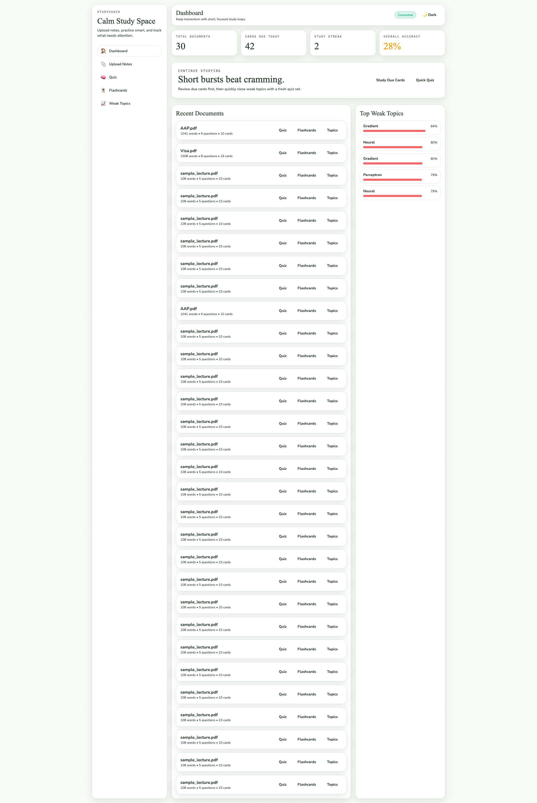
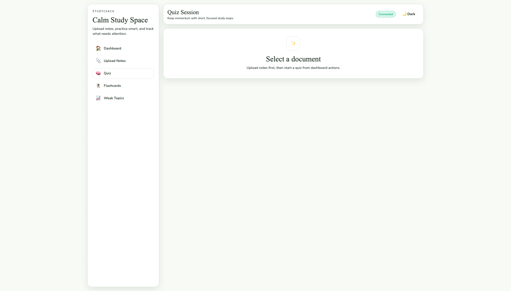
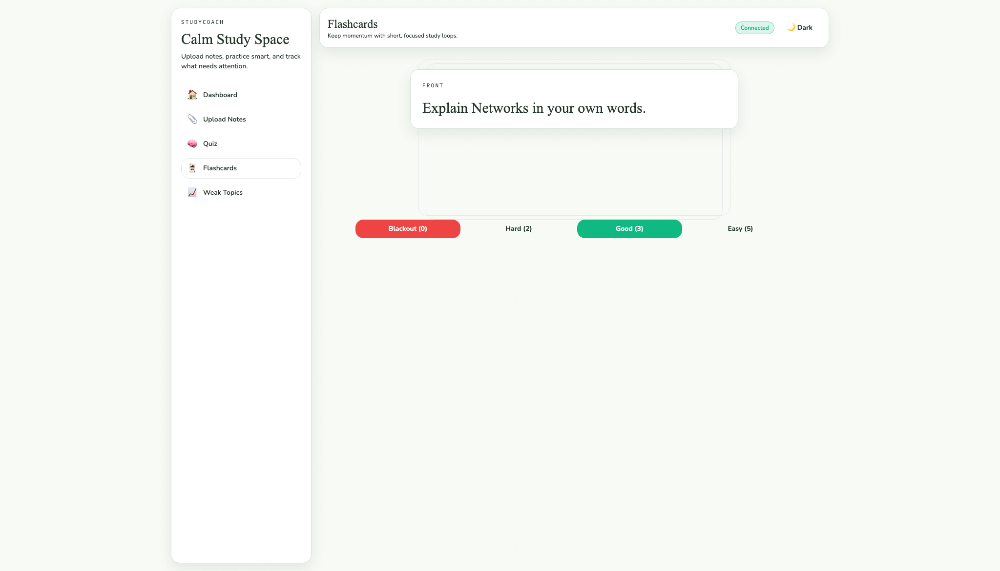
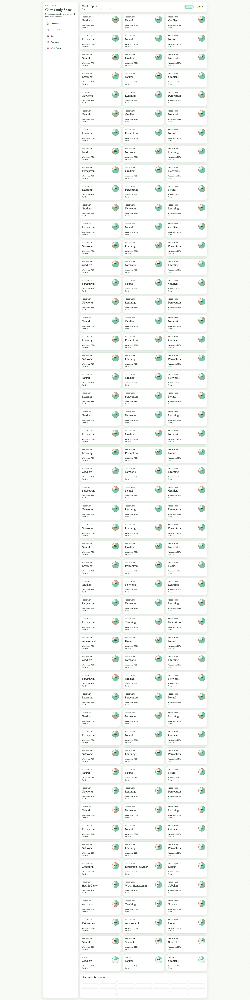

# StudyCoach

Real-time AI study coach that ingests lecture notes/PDFs, then generates quizzes, spaced-repetition flashcards, weak-topic insights, and study stats.

## One-Command Start

```bash
npm run setup && npm run dev
```

Frontend: `http://localhost:5173`  
Backend API: `http://localhost:3001`

## Screenshots

### Dashboard


### Quiz


### Flashcards


### Weak Topics


## Architecture

```text
┌───────────────────────────────┐
│ React + Vite + Zustand        │
│ Pages: Upload/Quiz/Flashcards │
└───────────────┬───────────────┘
                │ REST
┌───────────────▼───────────────┐
│ Express API                    │
│ /upload /jobs /quiz /topics    │
│ /flashcards /stats             │
└───────────────┬───────────────┘
                │
        ┌───────▼────────┐
        │ SQLite         │
        │ better-sqlite3 │
        └───────┬────────┘
                │
     ┌──────────▼──────────────┐
     │ NLP Pipeline             │
     │ Tier 1: Ollama llama3    │
     │ Tier 2: Transformers.js  │
     │ Fallback: heuristics     │
     └──────────────────────────┘
```

## NLP Pipeline

1. The backend checks `OLLAMA_URL` (`/api/tags`) to detect local Ollama.
2. If available, quiz/topic naming JSON generation uses `llama3` via `/api/generate`.
3. If unavailable, Transformers.js pipelines load lazily (`Xenova/distilbart-cnn-12-6`, `Xenova/bert-base-uncased`) with cache at `MODELS_CACHE_DIR`.
4. If model loading fails, heuristic question/topic generation is used so the app still functions offline.

## SM-2 in Plain English

Each flashcard review gets a quality score `0-5`.

- Low score (`<3`) resets the card to short interval (1 day).
- Good scores grow interval from `1` day to `6` days, then multiplicatively.
- Ease factor adapts per card and never goes below `1.3`.
- Next review date is computed automatically from the updated interval.

## Weak Topic Calculation

For each topic:

- `quizAccuracy = correct / total` (0 if no attempts)
- `flashcardAvgQuality = average review quality` (defaults to 5 if no reviews)
- `weakScore = (1 - quizAccuracy) * 0.6 + (1 - flashcardAvgQuality/5) * 0.4`
- Trend compares last 3 quiz attempts vs previous 3 (`improving`, `declining`, `stable`)

Sorted descending by `weakScore`.

## Add More Documents

1. Open `/upload`
2. Drop a `.pdf`, `.txt`, or `.md` file
3. Wait for async job steps to complete
4. Continue in quiz/flashcards dashboard actions

## Testing

Run all tests:

```bash
bash scripts/test-all.sh
```

Or individually:

```bash
cd backend && npm run test:unit && npm run test:integration
cd frontend && npm run test:unit
npm run test:e2e
```

## Known Limitations

- Scanned image PDFs without OCR text cannot be parsed.
- Heuristic fallback questions are lower quality than local LLM output.
- Offline queue currently stores actions in memory for the current tab session.
- Very large documents are chunked implicitly by sentence extraction and may lose long-range context.
